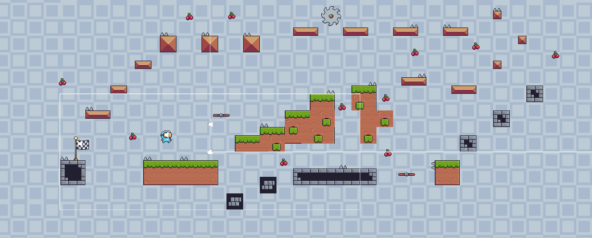

# Blue Main Character
> [Description](#description) | [Install and Set-up](#install-and-set-up) | [Release](#download-the-latest-release) | [Screenshot Demo](#screenshot) | [Main Features include](#main-features-include) | [Tutorial](#tutorial)
## Description:
- A game made by Unity engine (C#)
> [_Video-Demo_](https://youtu.be/RMzKPTu2Nwo)
- Author: [_Mèo leo đèo_](https://github.com/meoleodeo)
## Install and Set-up:
```bash
git clone https://github.com/Meoleodeo/Blue-Main-Character
cd .\Blue-Main-Character\SetUp\
start '.\Blue Main Character - Setup.exe'
start .\version.vbs
```
## [_Download the latest release!!_](https://github.com/Meoleodeo/Blue-Main-Character/releases)
## Screenshot:

## Main Features include:
- Depends on [version](https://github.com/Meoleodeo/Blue-Main-Character/releases)
- update later
## Tutorial:
- Press W_Key or Space_Key: jump
- Press A_Key or Left_Key: move left
- Press D_Key or Right_Key: move right


